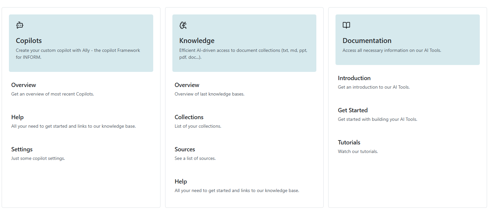
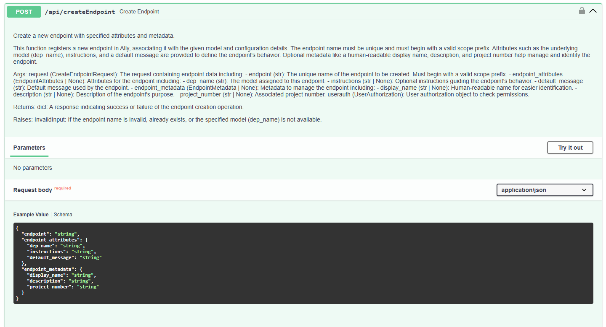
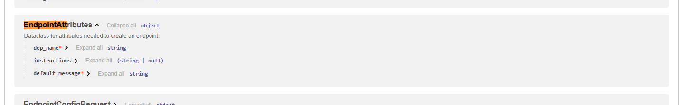

# Meta Ally Standalone Project
## What is the idea of a Meta Ally?
At the current stage setting up a **Copilot** on our **configuration page**, might be bit user unfriendly and requires training or experience. For example, a layman might have a hard time to understand why we need a **RAG** system when building a copilot, and what the capabilities of such a system are. Even when the user understands all of these things, there are still **multiple steps** specific to our configuration page involved when creating and setting up such a Copilot. 
These steps involve: 
- Creating an endpoint with **meta-data** like a display name and a route. 
- Configuring your endpoint by defining things like a **specific LLM**, **system prompt**, a **greeting message**, **history reduction** and a set of **plugins**.
- Defining the **plugin configuration** including **AI Knowledge**
- (Optional but most often used) Setting up **AI Knowledge**
    - Creating one or more **sources**
    - Combining sources in a **collection**
    - **Indexing** the collection
    - Configuring the plugin in the **copilot configuration**

The idea now is to create a Meta-Ally, that integrates everything above and helps you with creating and configuring your own copilot.
The Meta-Ally should exhibit agentic behaviour by being able to actively and autonomously creating and configuring new endpoints with all its features and explain to the user everything he needs to know on the way.

This project will enhance usability of the Ally configuration and will as a side-effect explore exisiting agent frameworks and hopefully improve the existing code base of the ally project.

## What has been done yet?
The **intial idea** for the **Meta-Ally** was to extend the functionality of the **original Ally** and use it **as its base**.
So when I started my internship in september,I began by exploring the ally repository.

One obvious **bottleneck** inside the code was the **lacking flexibility** when it came to **new LLMs** and its providers. One solution would be to **migrate** the project to an **existing framework** such as **langchain or pydantic-ai**. As part of my exploration on the current state of the project I tried including a new DialogEngine based on such frameworks but quickly found that the project already grew so much without having such a framework at core, that many **advantages** of adding such a framework would be **miniscule**.

So I decided with Max, that it might be best to move the project to a **standalone version** and develop with a new framework at heart. 

During my initial exploration phase I specifically researched Langchain and Pydantic AI as potential frameworks. Due to its type-safe nature and extensive documentation I found that **Pydantic AI** would be a great fit to move further.

### Tools
One defining feature of an agent is his ability to use tools. In order to let the Meta-Ally help users creating new copilots and setting up new sources and collections in AI knowledge, we need to equip it with the tools to do so. So that is where I began. 
I had to turn the respective APIs from the ally and ai knowledge configuration into tools that were compatible with a pydantic ai agent.

I started by parsing the openapi specification of each api respectively. Luckily these have been generated with pydantic models at heart making it relatively easy to generate tool definitions together with parameter description json that we can then feed to our agents.
Even though there was still a lot of effort involved, turning these opertions into callable functions, by having to for example recursively solve different pydantic models from theire request bodies.

### Agents

After defining the tools we can now start by creating some agents and see if we can actually call some tools. Pydantics out-of-the-box agent implementation offers a simple to use ReAct implementation. For that I created an agent factory, that lets me simply define agents with a specific prompt and a specificed group of tools curated from the extensive list of tools from the respective apis. 

### UI

To be ablet to interact with an agent, we can either define static messages in code, use the terminal or what is probably prefarable use a frontend in your browser. Pydantic AI offers out-of-the-box a method to turn your agent into ag-ui based application, that can then be used with any frontend that implements the AG-UI protocol. In my example I chose the CopilotKit.

### Evaluation

In order to give any statement on the performance of your agent, you need to test or evaluate it first. Pydantic also offers their own way on how to evaluate agents like this. It works by defining **cases**, **tasks** and **evalauators**. Pydantics evaluation method is not bound to be used with their agents implementation so I had to define how evaluation excactly looks myself.

I chose to evaluate message histories allowing me to measure the performance in multi turn conversation.

I chose to create datasets with specific users in mind, and to create full conversation from it. During the conversation I stop at various points to create a **case** in this moment of the conversation, that I will then use to measure the performance of the agent.

Evaluation happens by either using LLMJudges or evaluators that I wrote myself for example by comparing the names of tools that I would expect the agent to call.

### Logfire

Logfire is Pydantic own observation platform. It lets you easily collect traces of your llm application and sends it to their server. Later you can visit these traces on their webpage and inspect your agents performance from there.

You can also inspect your evaluation experiments from there:

## Limitations 
There is no working Human In The Loop/Tool Approval
Evaluation is not super mature, would need to be able to call functions before and after specific cases to setup configurations.
